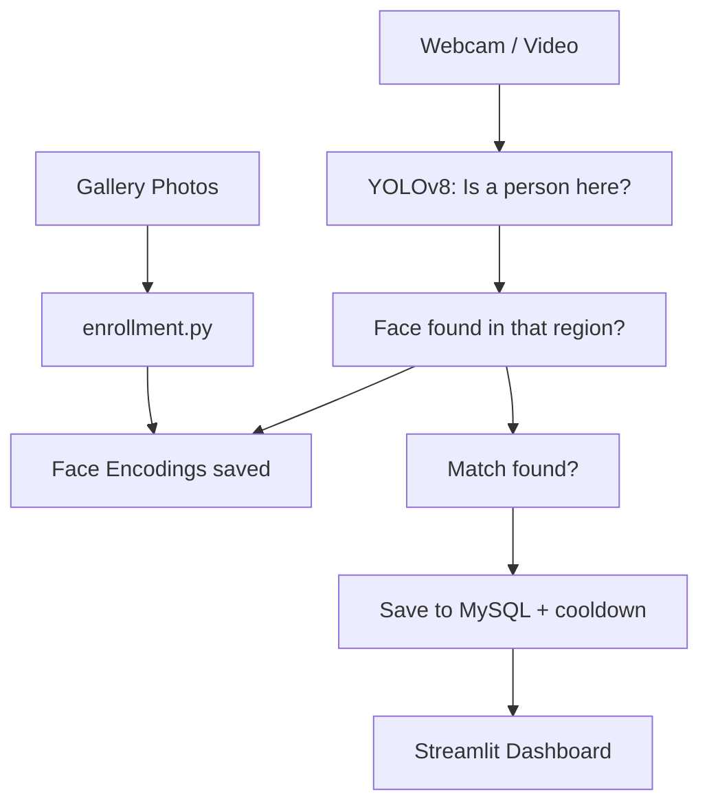

# 🎯 IdentiTrack

### AI-Powered Person Re-Identification & Real-Time Tracking System

[](https://www.python.org/)
[](https://opencv.org/)
[](https://ultralytics.com/)
[](https://streamlit.io/)
[](https://www.mysql.com/)

I Built IdentiTrack to really understand how a computer vision system works — not just 
detecting people in a video, but turning that into something actually useful: knowing who 
showed up, when, and for how long.

You show it a few photos of someone once. After that, it Recognizes them — on a live 
webcam or in an uploaded video — using two steps: first YOLOv8 checks if a person is there 
at all (even if their face isn't visible), then Face Recognition figures out who it is. 
Every match gets saved to MySQL, and a Streamlit dashboard turns that data into something 
you can actually read — peak hours, how often someone showed up, trends over time.

Building this meant thinking like two people at once: an engineer trying to get the 
detection right, and an analyst trying to Make the data Actually mean something.

---

## 🔑 Highlights

- **Two-Stage Detection Pipeline** — YOLOv8 For Person Detection + Face Recognition For Identity Matching, So Presence Is Detected Even When a Face isn't Visible
- **Dual Input Modes** — Real-Time webcam tracking *and* Uploaded video File Processing
- **Full Data Pipeline** — From Raw Video Frames → Structured MySQL Records → Interactive Analytics Dashboard
- **Production-Conscious Design** — Cooldown-Based Deduplication, Secure Credential Handling Via `.env`, And a Clean Modular Codebase

---

## 🚀 Features

- 👤 **Face enrollment** — add someone by just dropping a few of their photos in a folder
- 🎯 **Two-stage detection** — YOLOv8 checks if a person is there at all, then face recognition figures out who it is
- 📹 **Live webcam tracking** — runs in real time, draws boxes and names right on screen
- 🎬 **Works on video files too** — not just live webcam, you can upload a video and it'll process the whole thing
- 🗄️ **Logs to MySQL** — with a cooldown so it's not spamming the same detection every frame
- 📊 **Dashboard with real analytics** — peak hours, who showed up when, daily trends, and you can export it all as CSV
- 🔍 **Filter by person or date** — easy to dig into specific records
- 🔒 **Keeps credentials safe** — DB password lives in a .env file, never in the code

---

## 🛠️ Tech Stack

| Layer | Technology |
|---|---|
| Language | Python 3.10 |
| Person Detection | YOLOv8 (Ultralytics) |
| Face Recognition | `face_recognition` (dlib-based, 128-d facial embeddings) |
| Video Processing | OpenCV, imageio (H.264 encoding) |
| Database | MySQL |
| Dashboard | Streamlit |
| Data Analysis | Pandas |
| Configuration | python-dotenv |

---

## 🧠 How It Works



Basically, Here's what happens step by step:

1. You drop a few photos of someone into `gallery/<PersonName>/`, and `enrollment.py` 
   converts each face into a set of 128 numbers (a kind of fingerprint) saved in `encodings.pkl`.

2. When the Webcam or a video runs, every Single frame goes through YOLOv8 first — it just 
   checks "is there a person here?", whether or not their face is visible.

3. If a Person is found, the system looks for a face inside that Region. If there's one, 
   it compares it against all the saved fingerprints to figure out who it is.

4. Whenever it finds a match, it saves that to MySQL — but with a cooldown, so it's not 
   logging the same person every single frame while they're just standing there.

5. The Dashboard then reads all this data back and turns it into something useful — 
   detection counts, busiest hours, trends over time and so on.


## 📁 Project Structure

```
IdentiTrack/
├── gallery/                  # photos of people to enroll, one folder per person
├── config.py                 # all the settings in one place (DB creds come from .env)
├── enrollment.py              # reads gallery photos, saves face encodings
├── tracker.py                  # live webcam tracking - the main detection loop
├── video_processor.py           # same detection logic, but for uploaded videos
├── database.py                   # all the MySQL stuff - save, fetch, clear
├── dashboard.py                   # the Streamlit app - charts, filters, everything
├── requirements.txt                # pip install -r this and you're set
└── README.md
```

## ⚙️ Getting Started

```bash
# 1. Navigate into the project folder
cd IdentiTrack

# 2. Create and activate a virtual environment
python -m venv venv
venv\Scripts\activate        # Windows

# 3. Install dependencies
pip install -r requirements.txt

# 4. Configure your database credentials
# Create a .env file in the root folder:
echo DB_PASSWORD=your_mysql_password > .env

# 5. Create the MySQL database and table
```
```sql
CREATE DATABASE identitrack_db;
USE identitrack_db;

CREATE TABLE detections (
    id INT AUTO_INCREMENT PRIMARY KEY,
    person_name VARCHAR(100),
    detected_at DATETIME DEFAULT CURRENT_TIMESTAMP
);
```
```bash
# 6. Add reference photos to gallery/<PersonName>/, then enroll
python enrollment.py

# 7. Run live tracking
python tracker.py

# 8. Launch the analytics dashboard
streamlit run dashboard.py
```

## 📊 Future Scope

There's a lot of Advanced stuff I intentionally didn't build into this version — things like 
handling cases where Two people cross paths and the system has to figure out who's who, which 
is honestly a whole research Area on its own. For this project, I focused on getting a complete, 
understandable pipeline working end-to-end rather than a half-built complex one. A few things 
I'd like to add going forward:

- Support for multiple camera feeds running at once
- Real-time alerts when a specific person is detected
- Docker-based deployment for a more production-ready setup
- Better handling of crowded scenes using segmentation-based detection
- Automated daily/weekly summary reports

## 👨‍💻 Author

**Abhay Marwade**

Aspiring Data Analyst | Data Science & AI Enthusiast

🔗 GitHub: [ABHAYMARWADE2004](https://github.com/ABHAYMARWADE2004)
